Single Cell Workshop - Clustering and cell type identification
================
Asif Javed

-   [Data download](#data-download)
-   [Prerequisite](#prerequisite)
-   [Install packages](#install-packages)
-   [Read in the dataset and Create a Seurat
    object](#read-in-the-dataset-and-create-a-seurat-object)
-   [Data processing](#data-processing)
-   [Choosing the number of principal
    components](#choosing-the-number-of-principal-components)
-   [Clustering](#clustering)
-   [Cluster enriched markers](#cluster-enriched-markers)
-   [Reference based cluster
    annotation](#reference-based-cluster-annotation)

## Data download

We will use a PBMC dataset containing about 10K cells. This dataset was
made publicly availablbe by 10X Genomics and can be downloaded from:
[link to
data](https://www.dropbox.com/s/wn4mgwkkzqw2pox/SC3_v3_NextGem_DI_PBMC_10K_filtered_feature_bc_matrix.h5?dl=0)

Please copy this dataset to the working directory you intend to use for
the workshop.

## Prerequisite

The workshop content is inspired by multiple
<a href="https://satijalab.org/seurat/articles/get_started.html">Seurat
vignettes</a>. It assumes you are familiar with the initial quality
control. It starts from the data x cell filtered matrix generated by
cellranger; a common starting point for most analysis.

We will focus on two specific key tasks for single cell RNA sequencing
analysis: clustering and annotation of the identified clusters.

## Install packages

Let’s start by installing the necessary packages one by one

``` r
# install packages
install.packages("Seurat",repos = "http://cran.us.r-project.org")
```

``` r
install.packages("hdf5r",repos = "http://cran.us.r-project.org")
```

``` r
install.packages("clustree",repos = "http://cran.us.r-project.org")
```

``` r
if (!requireNamespace("BiocManager", quietly = TRUE))
    install.packages("BiocManager",repos = "http://cran.us.r-project.org")
```

``` r
BiocManager::install("SingleR")
```

``` r
BiocManager::install("celldex")
```

And loading them into R.

``` r
# load into your session
library(dplyr)
library(Seurat)
library(patchwork)
library(clustree)
library(SingleR)
library(celldex)
```

## Read in the dataset and Create a Seurat object

The first step is to read 10X sequencing data and convert it to a seurat
object. The Seurat object serves as a container that initially holds
just the UMI count matrix. But throughout the workshop, we add further
analysis content to it (e.g. PCA, clustering results). You can learn
more about the `Seurat object` from
[here](https://github.com/satijalab/seurat/wiki/Seurat#object-information).

We begin by reading the count matrix using `Read10X_h5 reads` count
matrix from 10X CellRanger hdf5 file. The Hierarchical Data Format (HDF5
or H5) format provides a more compressed representation of the data.
Seurat package includes multiple read functions depending on the format.

While reading the data, we apply rudimentary quality control to discard
low quality cells with less than 200 expressed features (genes) and
lowly expressed features observed in less than 3 cells.

``` r
pbmc.data <- Read10X_h5(filename="./SC3_v3_NextGem_DI_PBMC_10K_filtered_feature_bc_matrix.h5")
pbmc <- CreateSeuratObject(counts = pbmc.data, project = "pbmc10k", min.cells = 3, min.features = 200)
pbmc[["percent.mt"]] <- PercentageFeatureSet(pbmc, pattern = "^MT-")
pbmc <- subset(pbmc, subset = nFeature_RNA > 200 & nFeature_RNA < 5000 & percent.mt < 15)
```

Next we calculate the percentage contribution of mitochondrial RNA to
the total RNA content. High mitochondrial content can be indicative of
low quality cells undergoing apoptosis. We apply another round of
quality control based on the distribution of mitochondrial content and
number of features per cell. Too low features can indicate ambient RNA
contamination in empty droplets. Too high features might be caused by
multiple cells caught in the same droplet.

``` r
pbmc[["percent.mt"]] <- PercentageFeatureSet(pbmc, pattern = "^MT-")
pbmc <- subset(pbmc, subset = nFeature_RNA > 200 & nFeature_RNA < 5000 & percent.mt < 15)
```

## Data processing

After quality control measures to select cells for further analysis, the
next steps involve normalizing the data, identifying highly variable
features, and scaling. Principal component analysis is also computed as
many of the downstream analysis steps will be conducted in a lower
dimensionality space.

``` r
pbmc <- NormalizeData(pbmc)
pbmc <- FindVariableFeatures(pbmc, selection.method = "vst", nfeatures = 2000)
all.genes <- rownames(pbmc)
pbmc <- ScaleData(pbmc, features = all.genes)
```

    ## Centering and scaling data matrix

``` r
pbmc <- RunPCA(pbmc, verbose = FALSE)
```

The rationale of all the preceding steps are relevant to quality control
are covered in much greater detail in an earlier tutorial.

## Choosing the number of principal components

<b>First big decision - how many principal components (PCs) should you
retain for your downstream analysis?</b> The more PCs you keep the more
signal, also more noise, and the compute requirements increase as well.
Before you make this choice, examine the genes correlated with each
principal component. Presence of cell type specific genes would indicate
the principal component is informative. Presence of all unrelated gene
names would indicate otherwise. In PBMC context, we expect the major
cell types to be T cells, B cells, NK cells, monocytes and so on.

Examine top 10 PCs, you will see a lot of familiar gene names.

``` r
print(pbmc[["pca"]], dims = 1:10, nfeatures = 5)
```

    ## PC_ 1 
    ## Positive:  LTB, IL32, TRAC, CD3D, TRBC2 
    ## Negative:  FCN1, FGL2, CST3, IFI30, TYMP 
    ## PC_ 2 
    ## Positive:  MS4A1, CD79A, BANK1, IGHM, NIBAN3 
    ## Negative:  IL32, GZMM, CD3D, CD7, CD247 
    ## PC_ 3 
    ## Positive:  GZMB, CLIC3, NKG7, GNLY, KLRD1 
    ## Negative:  CCR7, LEF1, TRABD2A, TCF7, LTB 
    ## PC_ 4 
    ## Positive:  CD79B, MS4A1, GNLY, CD79A, LINC00926 
    ## Negative:  LILRA4, CLEC4C, SERPINF1, TPM2, SCT 
    ## PC_ 5 
    ## Positive:  CDKN1C, HES4, CTSL, TCF7L2, BATF3 
    ## Negative:  S100A12, ITGAM, VCAN, CES1, MGST1 
    ## PC_ 6 
    ## Positive:  CDKN1C, NRGN, PADI4, CKB, FCGR3A 
    ## Negative:  CRIP1, GBP5, ISG15, NIBAN1, MAF 
    ## PC_ 7 
    ## Positive:  CLU, ITGB1, NRGN, LIMS1, GP1BB 
    ## Negative:  MALAT1, CCR7, TXK, LINC02446, KLRK1 
    ## PC_ 8 
    ## Positive:  MAP3K7CL, SERPING1, GMPR, LGALS2, NEXN 
    ## Negative:  CDKN1C, VIM, S100A4, CKB, ITGB1 
    ## PC_ 9 
    ## Positive:  HERC5, IFIT1, RSAD2, IFIT3, MX1 
    ## Negative:  CLEC10A, FCER1A, ENHO, CD1C, CACNA2D3 
    ## PC_ 10 
    ## Positive:  TNFRSF13B, IGHG1, IGHA1, SSPN, IGFBP7 
    ## Negative:  TCL1A, CD8A, TRGC2, GZMK, CD8B

Examine PCs 40 to 50, the gene names would be be less familiar (at least
to most of us).

``` r
print(pbmc[["pca"]], dims = 40:50, nfeatures = 5)
```

    ## PC_ 40 
    ## Positive:  APOL4, AC006141.1, OASL, IER5L, CMPK2 
    ## Negative:  IKZF2, GPAT3, CXCL8, LY6E, KLRC3 
    ## PC_ 41 
    ## Positive:  IGLC3, IGLC2, IGHG3, IGHG1, KCNG1 
    ## Negative:  IGKC, IGHA2, IGHA1, NXPH4, CD9 
    ## PC_ 42 
    ## Positive:  PASK, IGKC, KCNG1, ALOX5AP, CCR10 
    ## Negative:  TNFRSF18, IGLC2, CDK6, IGLC1, LIMS2 
    ## PC_ 43 
    ## Positive:  FXYD2, IGLC2, IGLC3, DTHD1, DHRS9 
    ## Negative:  HIVEP3, ID2, SPINK2, HSPA5, CYTOR 
    ## PC_ 44 
    ## Positive:  IGLC3, IGLC2, CCR10, FUT7, LPAR6 
    ## Negative:  CHML, FEN1, RTKN2, PELI1, HSP90B1 
    ## PC_ 45 
    ## Positive:  IGLC3, IGLC2, TAGLN2, TLE1, IDO1 
    ## Negative:  IGKC, FEN1, KLRC2, KLRC3, MAN1A1 
    ## PC_ 46 
    ## Positive:  IL4I1, MARCKSL1, PARVB, IL1RN, IGHG1 
    ## Negative:  HSPA1B, SIGLEC6, MAP3K8, IGHA2, IGHA1 
    ## PC_ 47 
    ## Positive:  HBEGF, PTGS2, DST, SPATS2L, MPZL2 
    ## Negative:  IFIH1, HSPA6, TNFAIP3, NFKBIA, CDKN2A 
    ## PC_ 48 
    ## Positive:  AC127502.2, HIST1H1C, P2RX1, NEXN, IL2RA 
    ## Negative:  IGHA2, HIVEP3, FCRL5, LINC00662, TSPYL2 
    ## PC_ 49 
    ## Positive:  ZBP1, ADRB2, SERPINB10, LDLR, C2 
    ## Negative:  HIVEP3, FAM110A, CCDC191, MGLL, C1QA 
    ## PC_ 50 
    ## Positive:  RHOBTB3, IGHG3, IGHG1, ZNF208, BRCA2 
    ## Negative:  IGHA2, IGHA1, DAAM1, LY86-AS1, PHLDA1

Another way of visualizing this information is

``` r
VizDimLoadings(pbmc, dims = 1:2, reduction = "pca",balanced=TRUE)
```

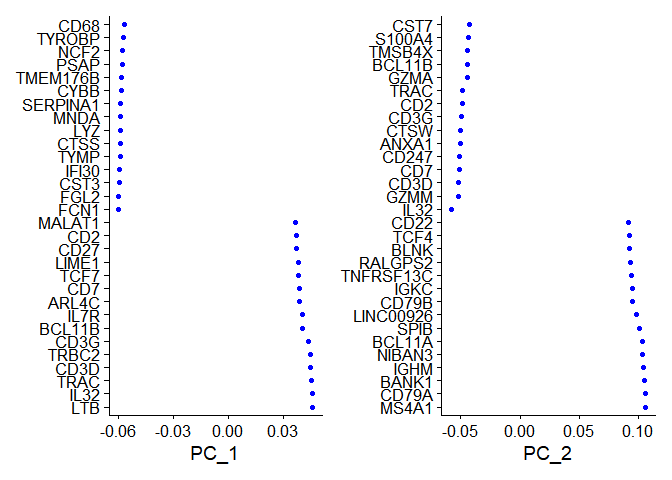<!-- -->

Yet another approach which provides a pictorial representation. The
cells and features are ordered based on the PCA scores. Setting a cell
number helps computational efficiency by ignoring the extreme cells
which are less informative. Forcing it to be balanced gives an equal
representation for both positive and negative correlations.

``` r
DimHeatmap(pbmc, dims = 1, cells = 500, balanced = TRUE)
```

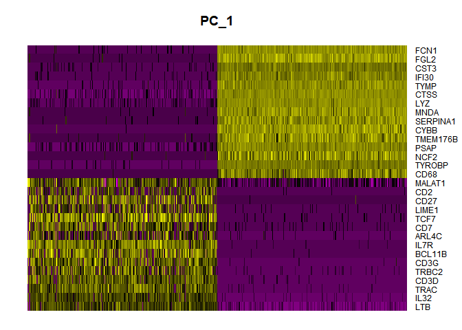<!-- -->

``` r
DimHeatmap(pbmc, dims = 1:15, cells = 500, balanced = TRUE)
```

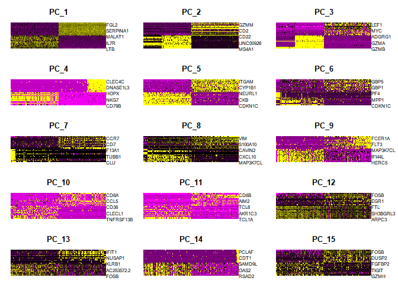<!-- -->

Jackstraw plot estimates the significance of the structure captured by
each principal component. It randomly permutes a subset of the data to
establish the null distribution against which the p values are
estimated.

:warning: This might take a bit of time to execute. Skip if you are
running behind and focus only on the elbow plot next

``` r
pbmc <- JackStraw(pbmc, num.replicate = 100)
pbmc <- ScoreJackStraw(pbmc, dims = 1:20)
JackStrawPlot(pbmc, dims = 1:20)
```

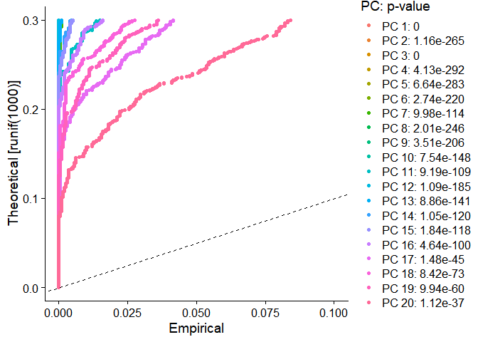<!-- -->

Elbow plots are the classic computer science way to examine the
accumulative variability within the data represented by the addition of
each principal component.

``` r
ElbowPlot(pbmc,ndims=50)
```

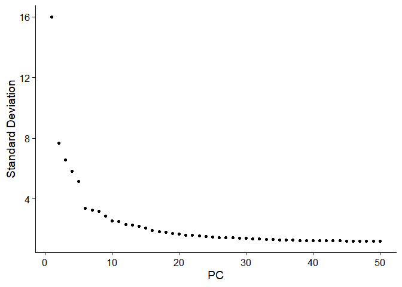<!-- --> Based
on these plots, we chose 20 PCs for this workshop. But an argument can
be made for any number in the range 15 to 30.

We use umap to visualize the dataset throughout this workshop. Computing
it early before we need it.

``` r
pbmc <- RunUMAP(pbmc, dims = 1:20, verbose = FALSE)
```

## Clustering

Seurat default clustering algorithm uses a graph based clustering
approach. It is inspired by previous publications developing and
refining the approach. In particular the [Phenograph
paper](http://www.ncbi.nlm.nih.gov/pubmed/26095251) is highly
recommended to those who want to understand the approach better. Briefly
the clustering algorithm first computes K nearest neighbors of each cell
in PCA space. Jaccard similarity between cells is calculated based on
shared neighborhood. The information is aggregated using Louvain
algorithm to iteratively group the cells together.

``` r
pbmc <- FindNeighbors(pbmc, dims = 1:20)
```

    ## Computing nearest neighbor graph

    ## Computing SNN

<b>Second big decision - choosing the resolution of clustering. </b>
Small number will generate admixed clusters while large number would
give too many clusters which are unlikely to be meaningful.

:memo: For your own research spend a bit of time optimizing the
resolution choice. It may be helpful to try the all downstream analysis
with multiple candidate choices of resolution.

Here we try three values of resolution and use clustree to study the
impact. We also save the pbmc object after computing the clusters.

``` r
pbmc <- FindClusters(object = pbmc,  resolution = c(0.5, 1, 1.5),  dims.use = 1:10,  save.SNN = TRUE)
```

    ## Suggested parameter: dims instead of dims.use
    ## 
    ## Suggested parameter: dims instead of dims.use

    ## Modularity Optimizer version 1.3.0 by Ludo Waltman and Nees Jan van Eck
    ## 
    ## Number of nodes: 9729
    ## Number of edges: 356102
    ## 
    ## Running Louvain algorithm...
    ## Maximum modularity in 10 random starts: 0.9145
    ## Number of communities: 16
    ## Elapsed time: 1 seconds
    ## Modularity Optimizer version 1.3.0 by Ludo Waltman and Nees Jan van Eck
    ## 
    ## Number of nodes: 9729
    ## Number of edges: 356102
    ## 
    ## Running Louvain algorithm...
    ## Maximum modularity in 10 random starts: 0.8655
    ## Number of communities: 20
    ## Elapsed time: 1 seconds
    ## Modularity Optimizer version 1.3.0 by Ludo Waltman and Nees Jan van Eck
    ## 
    ## Number of nodes: 9729
    ## Number of edges: 356102
    ## 
    ## Running Louvain algorithm...
    ## Maximum modularity in 10 random starts: 0.8279
    ## Number of communities: 22
    ## Elapsed time: 1 seconds

``` r
saveRDS(pbmc, file = "pbmc_tutorial.rds")
clustree(pbmc)
```

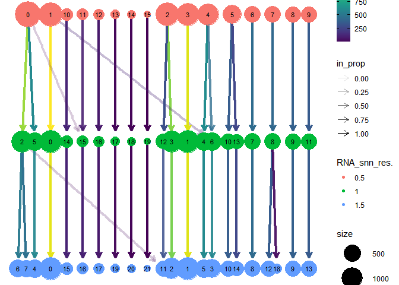<!-- -->

The three rows represent the cell assignment at each value of
resolution. The node sizes in each row indicate the number of cells in
that cluster. Arrows between rows show how the cluster assignment
changes with increasing resolution. Stable clusters may change names but
the cells would hang out together at different resolutions. Some
clusters may split into two (or more). That suggests increasing
resolution. But if you see a lot of back and forth jumping between
clusters, it indicates less stability. In your own data, its better to
over cluster, examine genes and then manually choose which clusters to
merge.

We chose resolution=0.5 for further examination

``` r
Idents(pbmc) <- pbmc$RNA_snn_res.0.5
DimPlot(pbmc, reduction = "umap", label=TRUE)
```

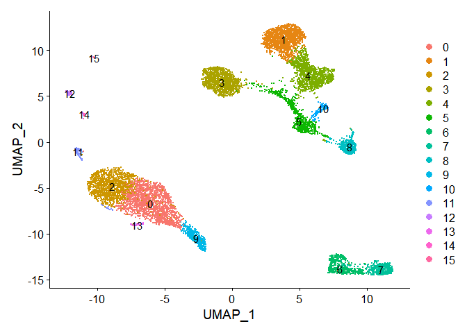<!-- -->

## Cluster enriched markers

Next, for every cluster we want to examine features (aka markers or
genes) which are highly expressed in this cluster in comparison to the
rest of the cells. We use ‘roc’ which estimates the classification power
of each marker (0 implies random, 1 implies perfect). We can do this
cluster by cluster or for all clusters at the same time.

``` r
cluster0.markers <- FindMarkers(pbmc, ident.1 = 0, logfc.threshold = 0.25, test.use = "roc", only.pos = TRUE)
```

:warning: Doing this for all clusters is quite time consuming. If you
want to take a break. Initiate this before doing so. It may take up to
30 mins to compute. If you are running late in terms of the tutorial
time, skip this and the following heatmap for now.

``` r
cluster.all.markers0.5 <- FindAllMarkers(pbmc, logfc.threshold = 0.25, test.use = "roc", only.pos = TRUE, min.pct = 0.25)
```

    ## Calculating cluster 0

    ## Calculating cluster 1

    ## Calculating cluster 2

    ## Calculating cluster 3

    ## Calculating cluster 4

    ## Calculating cluster 5

    ## Calculating cluster 6

    ## Calculating cluster 7

    ## Calculating cluster 8

    ## Calculating cluster 9

    ## Calculating cluster 10

    ## Calculating cluster 11

    ## Calculating cluster 12

    ## Calculating cluster 13

    ## Calculating cluster 14

    ## Calculating cluster 15

The heatmap gives a good pictorial representation of clusters which
share highly expressed markers. Notice the relation between these
clusters in the umap?

``` r
cluster.all.markers0.5  %>%
    group_by(cluster) %>%
    top_n(n = 5, wt = avg_log2FC) -> top5

DoHeatmap(pbmc, features = top5$gene) + NoLegend()
```

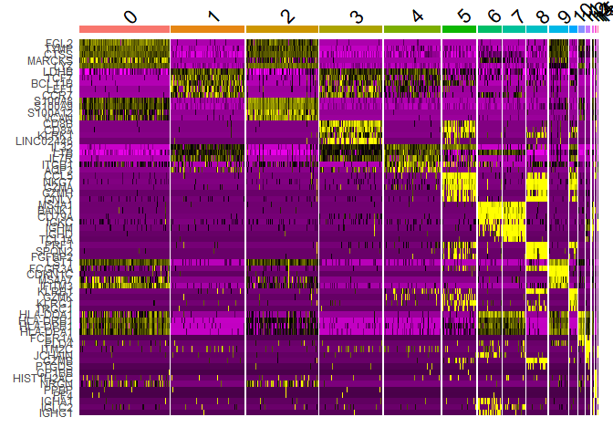<!-- -->

Next we pick some markers which tend to work well for PBMC datasets.
Many of these are from the cluster.all.markers0.5

``` r
markers.to.plot <- c("CD3D", "HSPH1", "SELL", "CD14", "LYZ", "GIMAP5", "CACYBP", "GNLY", "NKG7", "CCL5", "CD8A", "MS4A1", "CD79A", "FCGR3A", "MS4A7", "S100A9", "HLA-DQA1","GPR183", "PPBP", "GNG11", "TSPAN13", "IL3RA", "FCER1A", "CST3", "S100A12")

DotPlot(pbmc, features = markers.to.plot, cols = c("blue", "red"), dot.scale = 8) +RotatedAxis()
```

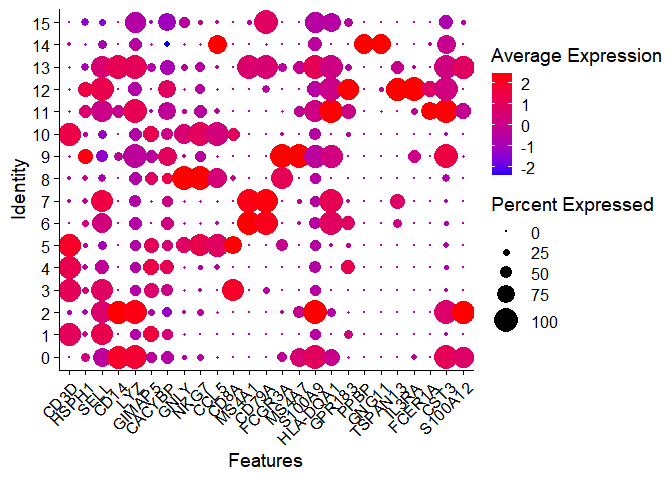<!-- -->

``` r
VlnPlot(pbmc, features = c("MS4A1", "CD79A"))
```

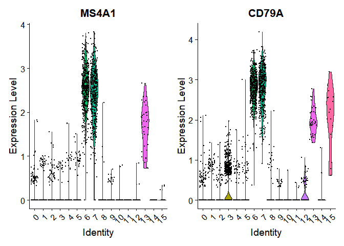<!-- -->

``` r
VlnPlot(pbmc, features = c("NKG7", "GNLY"))
```

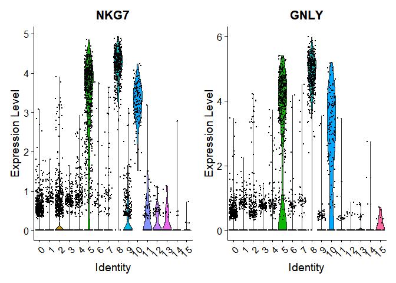<!-- -->

``` r
VlnPlot(pbmc, features = c("FCGR3A", "MS4A7"))
```

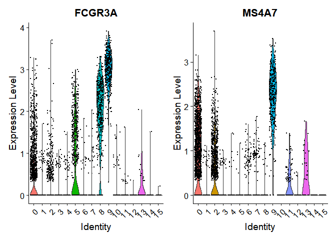<!-- -->

``` r
VlnPlot(pbmc, features = c("PPBP"))
```

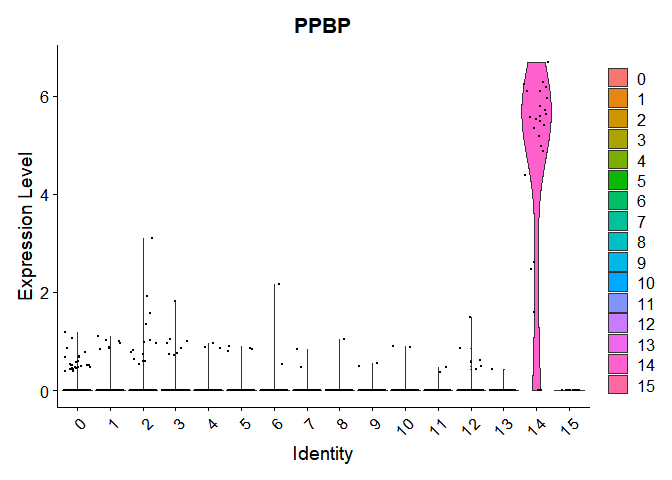<!-- -->

``` r
VlnPlot(pbmc, features = c("FCER1A", "CST3"))   
```

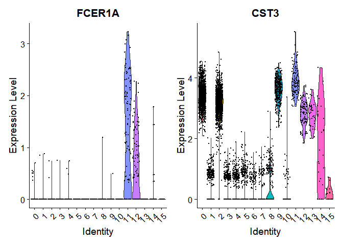<!-- -->

``` r
VlnPlot(pbmc, features = c("CD8A", "CD8B", "CD3D"))
```

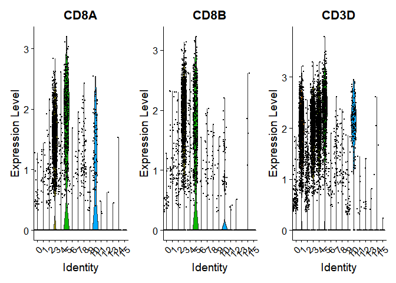<!-- -->

``` r
FeaturePlot(pbmc, features = c("MS4A1", "GNLY", "CD3E", "CD14", "FCER1A", "FCGR3A", "LYZ", "PPBP",  "CD8A"))
```

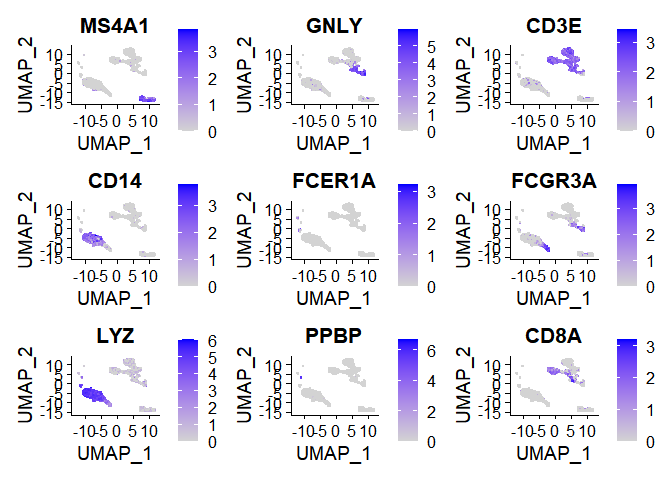<!-- -->

## Reference based cluster annotation

The reference based cluster annotation is outside the `Seurat` package.
For this we will use `SingleR` and begin by converting the information
from Seurat data to its format.

``` r
sce <- GetAssayData(object = pbmc, assay = "RNA", slot = "data")
```

We will use data from [a classic
paper](https://pubmed.ncbi.nlm.nih.gov/30726743/) which compares
different immune cell types using sorted cells. Reference based
annotation allows direct comparison with highly curated sets. However,
on the down side the inference is dependent on the sets defined in the
reference.

``` r
refMonaco <- MonacoImmuneData()
```

The data format presents information at two levels: main cell types and
finer resolution information

``` r
prediction_Monaco_main <- SingleR(test=sce, ref=refMonaco, clusters=Idents(pbmc), labels=refMonaco$label.main)
prediction_Monaco_fine <- SingleR(test=sce, ref=refMonaco, clusters=Idents(pbmc), labels=refMonaco$label.fine)

predicted_Monaco <- data.frame(cluster=sort(unique(Idents(pbmc))), Monaco_main= prediction_Monaco_main$labels, Monaco_fine= prediction_Monaco_fine$labels)
predicted_Monaco
```

    ##    cluster     Monaco_main                  Monaco_fine
    ## 1        0       Monocytes          Classical monocytes
    ## 2        1    CD4+ T cells            Naive CD4 T cells
    ## 3        2       Monocytes          Classical monocytes
    ## 4        3    CD8+ T cells            Naive CD8 T cells
    ## 5        4    CD4+ T cells               Th1/Th17 cells
    ## 6        5         T cells           Non-Vd2 gd T cells
    ## 7        6         B cells  Non-switched memory B cells
    ## 8        7         B cells                Naive B cells
    ## 9        8        NK cells         Natural killer cells
    ## 10       9       Monocytes       Intermediate monocytes
    ## 11      10         T cells                   MAIT cells
    ## 12      11 Dendritic cells      Myeloid dendritic cells
    ## 13      12 Dendritic cells Plasmacytoid dendritic cells
    ## 14      13       Monocytes          Classical monocytes
    ## 15      14     Progenitors             Progenitor cells
    ## 16      15         B cells                 Plasmablasts
